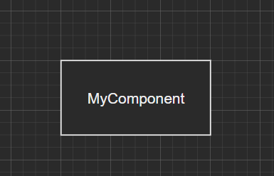
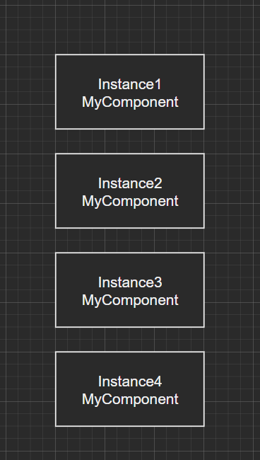
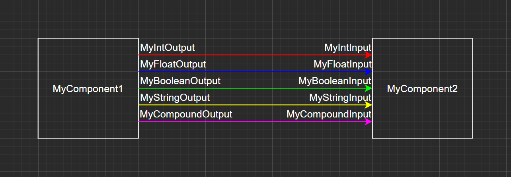
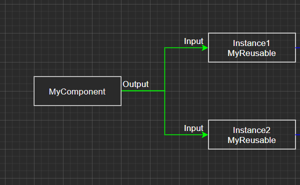
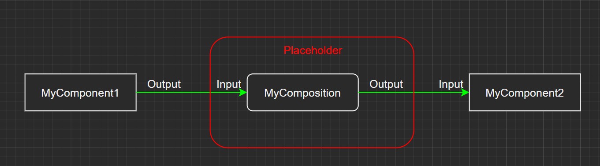
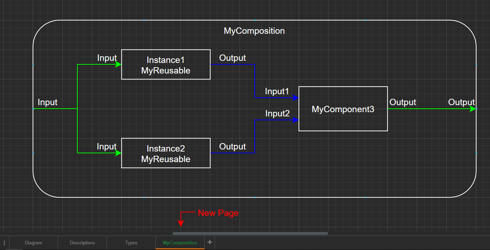
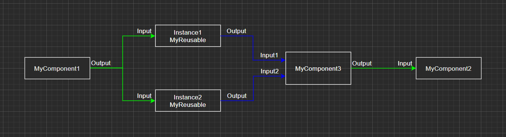
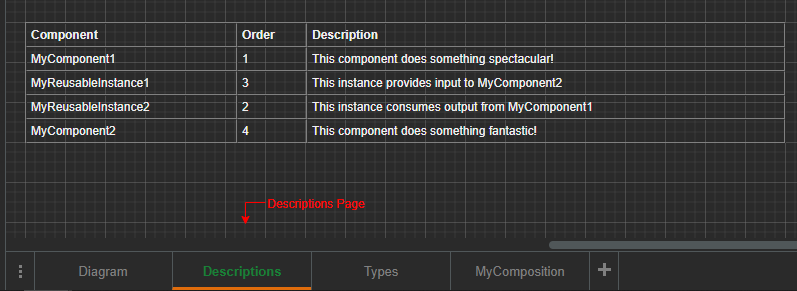
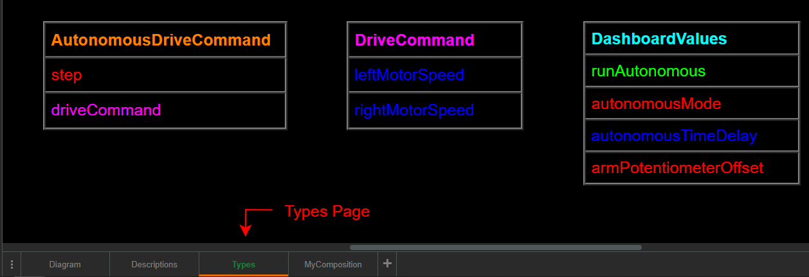

# Architecture Parser

## Overview

The Architecture Parser is a Windows Forms application that is intended for use with a custom code generation strategy used for robot code 
for teams competing in *FIRST* Robotics Competition (*FRC*). The application provides a GUI for allowing users to manually inspect and verify
their graphical software architectures (developed using [draw.io](https://www.draw.io/)) to ensure that the logical components of the
architecture are created and connected correctly. This application is also responsible for generating the template robot code project for
teams developing in a text-based programming language.

## Features

* Parse XML files exported from draw.io and display the architecture in a GUI that allows for manual verification
* Generate template robot code project for supported text-based programming languages:
  * Java
  * C++

***This application does not write your robot code for you! It merely provides a starting point for your robot project in a way that
more easily allows new programmers to understand the flow of data through your code.***

---

## Software Architecture Elements

Architecture Parser consumes XML files that are exported from draw.io. This website is a wonderful online tool for
diagram design in general, but it was not inherently designed for software architecture diagrams. Due to this, there are restrictions on how
a diagram can be created and guidelines for how to format your architecture in draw.io to ensure your template robot code is generated 
successfully. 

Architecture Parser currently supports the following architectural featues in draw.io diagrams:
* Components
* Reusable Components
* Connections
* Compositions
* Custom run order and component descriptions
* Compound Data Types

*If you need more information about how an architecture should be created or the requirements for a given diagram, please check out the
examples folder.*

---

### Components

A ***component*** is the simplest form of logic representation in your architecure. Each component represents a logical piece of your code
that is responsible for completing some task. For example, you may have a component responsible for reading all of the driver station input
or maintaining a PID controller. Components accept inputs, perform any necessary calculations on those inputs, then provide corresponding
outputs that are later consumed by other components. It is possible for a component to have no inputs and/or outputs.

#### Modeling in draw.io

Components are modelled in draw.io using a rectangle with sharp edges. Double clicking on the rectangle will allow you to enter the component's
name into the rectangle. Component names must follow traditional variable naming guidelines (only letters, numbers, and underscores are 
allowed, and the name must not start with a number).

#### draw.io example

---

### Reusable Components

A ***reusable component*** is nearly the same as a component. The only difference is that it can be used multiple times in the architecture.
When the template robot code project is generated, the code for the reusable component only needs to be written once and it will provide
its functionality for all instances where it's used. Each time the reusable component is used, you must ensure that every instance has the same
number of inputs and outputs and they all have the same name. 

*For information on defining inputs and outputs to reusable and non-reusable components, see the section on **Connections**.*

#### Modeling in draw.io

Reusable components, like regular components, use a rectangle with sharp edges. The name, however, is formatted slightly differently. Each
instance of the reusable component can have its own unique name, but the name must also include the name of the reusable component itself.
Put the name of the instance and the name of the reusable component on two separate lines within the rectangle. The first line will be the name
of the instance, and the second line will be the name of the reusable component.

#### draw.io example

---

### Connections

A ***connection*** is a way to describe the relationship between the outputs of one component and the inputs of another component, or how data
flows through the architecture. There are three main parts to a connection:
* The source of the connection
* The destination of the connection
* The data type of the connection

The source and destination of the connection can be a component, a reusable component, or a composition. The data type of the connection 
describes the type of data that's being transferred from the source to the destination. A connection with an integer data type between two
components, for example, would describe how the source component provides an integer that is then consumed by the destination component.

Connections can have one of five possible types:
* Integer
* Floating point
* Boolean
* String
* Compound

*For information on compound data types, please see the **Compound Data Types** section.*

#### Modeling in draw.io

Before modeling the connection itself, the source and destination of the connection need to be configured to accept connections. Connections 
are attached to **anchor points** on the components. Anchor points represent the inputs and outputs of the component. If you hover over the 
edge of a component with your mouse, you will see blue X's on the edge that are highlighted in green when you hover over one of them. Anchor 
points for a component must be configured according to the number of inputs and outputs the component has. 

Inputs shall be placed on the left edge of the component, while outputs shall be placed on the right edge of the component. For information 
on how to use anchor points, please see 
[this page](https://desk.draw.io/support/solutions/articles/16000067812-how-to-use-connectors-) of the draw.io support documents. For 
information on how to add/remove anchor points, please see 
[this page](https://desk.draw.io/support/solutions/articles/16000042498-how-to-add-remove-connection-points-how-to-connect-anywhere-on-a-shape-) 
of the draw.io support documents.

The connection itself is represented with a single-headed arrow connecting two achor points, one on the source component, one on the 
destination component. It's also recommended (although not required) that the connection should have sharp edges, use the orthogonal edge 
style, and use arc style line jumps. You may attach multiple connections to a single anchor point (for example, when the output of one 
component is consumed by multiple other components).

The source and destination of the connection must be named. The names do not necessarily need to be the names of the source and destination 
components since the names represent the inputs and outputs of the components, not the components themselves. For example, a component named 
"drivebase" supplies an output called "leftMotorSpeed". "leftMotorSpeed" would be the name of the source of the connection. Every connection 
must have names on both of its ends. The only exception is that if multiple connections are attached to a single anchor point, only one of the 
connections needs to have its source named. To name the source and destination of a connection, double click on the connection, type the name
of the input/output, and drag the text closer to the desired end of the connection.

Lastly, the data type of the connection is determined by the color of the arrow representing the connection. 
* Integer type connections are red (#FF0000)
* Floating point type connections are blue (#0000FF)
* Boolean type connections are green (#00FF00)
* String type connections are yellow (#FFFF00)
* Compound data type connections are a color chosen by the user (see the ***Compound Data Types*** section for more information).

#### draw.io example

The different types of connections:

Multiple connections attached to an anchor point

---

### Compositions

A ***composition*** is a placeholder for another part of the diagram. They're used primarily for organizing your architecture diagram into
groups of components that make up a larger portion of your architecture. For example the functional area of your drivebase may be made up of 
multiple components, but you can group all of these components into a single "drivebase" composition, allowing you to view only the drivebase
parts of your architecture and hide anything else you don't need.

*Compositions are only used in the draw.io editor to make reading your graphical architecture easier. They do not manifest in the generated
template robot code project in any way.*

#### Modeling in draw.io

There are two parts to modeling a composition in draw.io. First, a placeholder needs to be inserted into the architecture. This is done by
using a rectangle with rounded edges. You can then name your placeholder in the same way you would name a non-reusable component.

The second step is to create the content of the composition. To do this, create a new page in your draw.io diagram and give it the same name
you gave the placeholder you created in the original architecture. In this new page, insert a large rectangle with rounded edges, name it with
the name of the composition, then align the name to the top of the rectangle. From here, add the content of the composition (components)
inside the large rectangle.

#### draw.io example

Composition placeholder:

Composition content:

The equivalent architecture without compositions would look like this:

---

### Custom Run Order and Component Descriptions

When executing the robot code, the order in which the components execute needs to be specified (there's no use in running a component if the
other component that supplies its inputs hasn't run yet!). At the same time, descriptions of the task each component is intended to accomplish
are useful in making sure that the entire development team understands the structure of the architecture.

Architecture Parser leverages a second page in your draw.io diagram that contains this information. The information is stored in a table that
contains the name of the component (or the name of the instance of the reusable component), the order number that determines when the component
is executed, and the description of the component/instance of the reusable component.

There are many different types of tables in draw.io and the XML that's exported for each of them is slightly different. Architecture Parser was
written using Mockup Text style tables. To place Mockup Text style tables, click the "More Shapes..." button in the bottom left of the draw.io
editor, scroll to find the box for "Mockups" and check it, press apply, then find the "table" drawing in the "Mockup Text" tab that's been
added to the left pane in the editor.

Your run order and descriptions table should be inserted in its own page in your draw.io diagram, labeled "Descriptions". When you've entered
all of the necessary information into the table, it should look something like this:

---

### Compound Data Types

Sometimes a component will consume several inputs or provide several outputs that are closely related. For example, a command to the drivebase
motors will (often) include both left and right motor speeds. In situations where a component needs to interact with several related
inputs/outputs, the component can have individual connections for each of these values, or you can group multiple values into one connection
with a ***Compound Data Type***.

Using our command to the drivebase motors example, we can create a compound data type called "DriveCommand" that contains two floating point
values, the left motors' speed and the right motors' speed. With this compound data type, only a single connection needs to be made between
the providing and consuming components, rather than the two connections that would be needed to send the left and right motor speeds
individually. You can group any number of values into a compound data type, and the types of those values can be any of the supported
connection data types (integer, floating point, boolean, string, and even other compound data types).

A compound data type is created by adding a Mockup Text style table (please see the ***Custom Run Order and Component Descriptions*** section
for more information on this) to a new page in the draw.io diagram called "Types". Each table represents a single compound data type, and each
table can have at most one column, but any number of rows. The first row of the table contains the name of the compound data type itself 
(for example, "DriveCommand" or "DashboardValues"). The color of the name of the compound data type should be set to the color you wish to
represent the type with when creating connections in the architecture diagram. The rest of the rows in the table are the names of the 
individual values packaged into this compound data type. The color of the names of each of the values should correspond to the data type of the
value (red (#FF0000) for integer, blue (#0000FF) for floating point, green (#00FF00) for boolean, yellow (#FFFF00) for string, or the custom
color you defined if the value is a different compound data type).

An example of a completed "Types" page:

---

## Template Robot Code Project Structure

The implementation details are obviously dependant on the language that's being used for generation, but in general, there are a few main parts
to the code Architecture Parser generates:
* IPeriodic Interface
* Component Base Classes
* Component Classes
* Compound Data Type Classes
* The Robot Class

### IPeriodic Interface

The IPeriodic interface is implemented by all of the component base classes. The interface contains a single method, periodic(), that is called
every 20 milliseconds (or however quickly you configure your Timed Robot to execute its periodic functions). This interface is used to ensure
that the component class ALWAYS contains a periodic() method implementation (compilation will fail if a developer accidentally removes the 
periodic method implementation from the component class, for example).

### Component Base Classes

Component base classes are used primarily for handling the input and output of data. This abstraction allows the developer of the component
class to not worry about making sure that connections are made properly. The component base classes provide protected wrapper methods that 
the component classes can use to retrieve inputs and provide outputs.

### Component Classes

Component classes contain the logic that allows a component to complete the task it was designed to handle. Each component class has its own
base class that handles all of the data transmission to and from connected components, meaning the developer of the component class only needs
to focus on writing code that executes every periodic loop to complete the component's designated task. The component classes should be the
only files you'll be editing after the project is generated.

### Compound Data Type Classes

Each compound data type will have its own class, and each of the values packaged into the compound data type will be available as public member
variables (for example, DriveCommand.leftMotorSpeed). These classes will have get/set methods that prevent accidental overwriting of the data
contained in each of the values within the compound data type.

### The Robot Class

In the Robot class, instances of each of the components/reusable components will be created, and the connections between each of the instances
will be established. The Robot class will also contain a method "execute()" which calls the periodic functions of each of the component 
instances in the order specified in the table in the "Descriptions" page in the draw.io diagram.